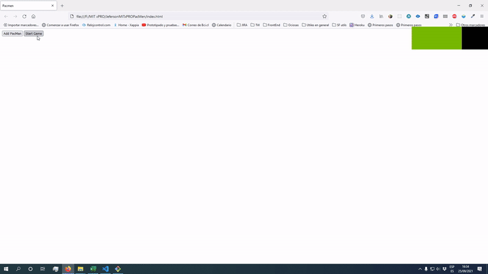

# PacMen Factory
A funny page with random pacmans walking around the whole page.

## Description
This simple page allows you to create pacmen with a random movement pattern. Just need to click on the <code>Add PacMan</code> button, to create a new pacman, and then just click on the <code>Start Game</code> button to see their movement along the page, bounding at the limits!!
## How to Run
#### 1. Download this repository.
Just clone or download this repository, and open the <code>index.html</code> file on your favorite web browser.
#### 2. Navigate to the github page.
Follow this link https://ziurn.github.io/JefersonMITxPROPacMen/
## Roadmap
There are some feature will be introduced in the future.
* Animated PacMen.
* Calculate collisions between the PacMen.
## License information
This code is under MIT licence, you can find the complete file [here](https://github.com/ZiurN/JefersonMITxPROPacMen/blob/main/LICENSE)